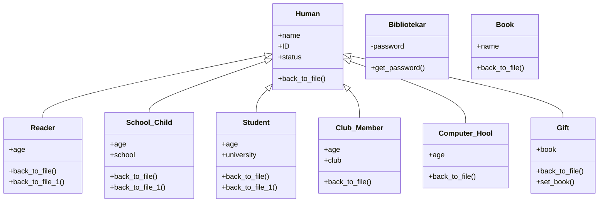

# Library Management System

Консольное приложение на Python для учёта читателей и книг библиотеки. Проект написан в парадигме ООП: есть иерархия классов пользователей, полиморфная сериализация объектов и выбор формата хранения данных (JSON или XML) прямо во время работы программы.

## О проекте

Библиотека обслуживает несколько типов посетителей: от разового гостя до библиотекаря с собственным аккаунтом. Для каждой роли определены свои права: кто может взять книгу домой, кто работает только в читальном зале, а кто выдаёт книги в подарок. Все действия пользователя (выдача книги, удаление своей истории и так далее) сохраняются в выбранный формат файла и подгружаются при следующем запуске.

Проект создавался как учебный, чтобы на практике закрепить:
- наследование и полиморфизм в Python;
- работу с файлами json и xml.etree.ElementTree;
- обработку пользовательского ввода и собственные исключения;
- проектирование единого интерфейса для двух разных форматов хранения данных.

## Возможности

| № | Роль | ID | Что может делать |
|---|------|----|----|
| 1 | Гость | `H_` | Брать книгу для чтения в зале |
| 2 | Читатель | `R_` | Брать книгу в зал и домой |
| 3 | Школьник | `C_` | Брать книгу в зал (возрастное ограничение) |
| 4 | Студент вуза | `S_` | Брать книгу в зал (возрастное ограничение) |
| 5 | Участник литературного клуба | `M_` | Читать книгу в клубе, работа только в зале |
| 6 | Посетитель компьютерного зала | `O_` | Заниматься за компьютером в зале |
| 7 | Библиотекарь | `B_0` | Служебный аккаунт (вход по паролю) |
| 8 | Подарочный аккаунт | `G_` | Получать книги в подарок бесплатно |

Общие для всех ролей действия: удаление своей истории (пункт `3`) и, для библиотекаря, удаление истории по чужому ID. При первом запуске также можно предложить свою книгу в фонд библиотеки: пункт меню `0`.

Каждый пользователь может создать новый аккаунт (New) или вернуться к уже созданному в текущей сессии (Return) по своему ID.

## Архитектура и ООП

В основе модели лежит базовый класс `Human`, от которого через наследование образованы все роли пользователей. Общая логика (имя, ID, статус, приведение к словарю для сохранения в файл) вынесена в родителя, а специфичные поля и статусы переопределены в потомках через `super()`.



Ключевые ООП-приёмы в проекте:

- **Наследование**: все роли пользователей расширяют `Human`.
- **Полиморфизм**: метод `back_to_file()` переопределён в каждом потомке и вызывает родительскую реализацию через `super().back_to_file()`, дополняя результат своими полями.
- **Инкапсуляция состояния**: статус объекта (`self.status`) меняется самим объектом в момент сериализации (`back_to_file()` для зала, `back_to_file_1()` для дома), а не снаружи.
- **Собственное исключение**: `Invalid_Key_1_2` для валидации пунктов меню.
- **Единый интерфейс хранения**: модули `json_job` и `xml_job` реализуют одинаковый набор функций (`add_human`, `delete_reader`, `save_json` / `save_to_xml` и так далее), поэтому `main.py` работает с ними взаимозаменяемо через одну переменную `handler`.

## Структура проекта

```
OOP_python/
├── main.py        # точка входа: меню, сценарии ролей, бизнес-логика
├── classes.py     # ООП-модель: Human и его потомки, Bibliotekar, Book
├── json_job.py    # слой хранения данных в JSON
├── xml_job.py     # слой хранения данных в XML
├── data.json      # файл хранения (создаётся/используется при выборе JSON)
├── data.xml       # файл хранения (создаётся/используется при выборе XML)
└── README.md
```

## Стек технологий

Python 3.12. Из стандартной библиотеки используются `json` и `xml.etree.ElementTree`. Сторонние зависимости не нужны.

## Установка и запуск

```bash
git clone <ссылка-на-репозиторий>
cd OOP_python
python3 main.py
```

Дополнительных зависимостей ставить не нужно. Проект использует только стандартную библиотеку Python.

## Пример работы

```
Здраствуйте! Это приложение для библиотеки имени Кучуева Вадима Анатольевича.
Напишите "Enter", если Вы хотите воспользоваться нашим приложением.
Напишите "End", если хотите завершить приём.

Введите "Enter" или "End": enter

Выбирите один из предоставленных вариантов, написав номер действия:
0. Добавьте в список свою книгу...
1. Гость(человек с ID на H_)...
...
Введите номер действия: 2

Напишите "New", если хотите создать новый аккаунт читателя.
Напишите "Return", если хотите вернуться в старый аккаунт.
Ввод: New

Вы решили создать новый аккаунт.
Ваш ID: R_0
Введите своё имя: Иван
Введите свой возраст: 20

Выберите вид файла, где будет храниться Ваша история, а именно json или xml.
Ввод json или xml: json

1. Взять книгу для чтения в зале.
2. Взять книгу для чтения домой.
...
Введите 1, 2, 3, 4, 5, 6, 7: 2
```

## Хранение данных

Формат выбирается в начале каждой операции с файлом: json или xml. Обе реализации хранят данные по одинаковым разделам: `humans`, `readers`, `schools`, `students`, `clubs`, `computers`, `gifts`, `BOOKS`.

Пример записи в `data.json`:
```json
{
    "name": "Иван",
    "ID": "R_0",
    "Status": "Hool",
    "age": 20
}
```

Тот же объект в `data.xml`:
```xml
<reader>
  <name>Иван</name>
  <ID>R_0</ID>
  <status>Hool</status>
  <age>20</age>
</reader>
```

## Возможные улучшения

Проект учебный, поэтому есть куда расти. Что можно добавить дальше:

- **Тесты**: покрыть `classes.py`, `json_job.py`, `xml_job.py` unit-тестами (`pytest`), особенно сериализацию и десериализацию туда и обратно.
- **Типизация**: добавить type hints и docstring ко всем функциям и методам.
- **Рефакторинг `main()`**: вынести повторяющийся код (валидация ввода `New`/`Return`, ввод возраста) в переиспользуемые функции-хелперы, чтобы убрать дублирование между восемью похожими сценариями.
- **Конфигурация**: вынести пароль библиотекаря и другие константы из кода в переменные окружения или конфиг-файл.
- **Логирование**: заменить часть `print()` на модуль `logging` с уровнями info/warning/error.
- **CLI-флаги**: добавить `argparse`, чтобы формат хранения (`--storage json|xml`) можно было задавать при запуске, а не только через `input()`.
- **Docker**: обернуть приложение в контейнер, как во втором проекте, для единообразного запуска.
- **Постоянное хранение сессии**: сейчас списки пользователей (`list_Human`, `list_Reader` и так далее) живут только в оперативной памяти на время сессии, их можно подгружать из файла хранения при старте.